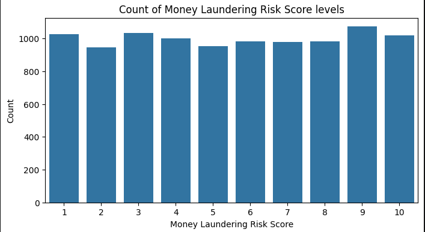
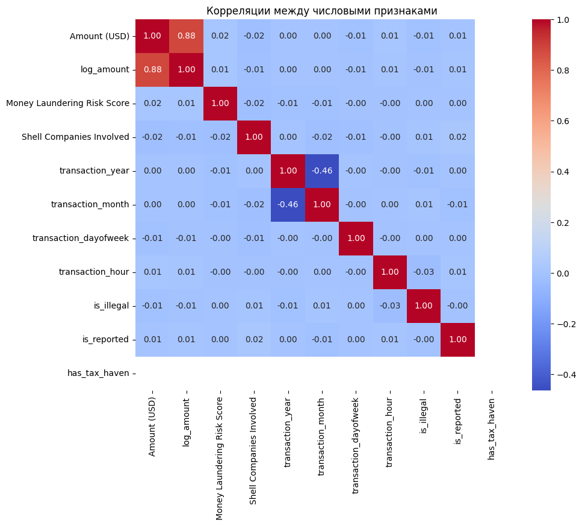
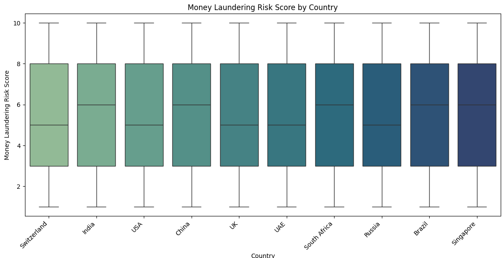
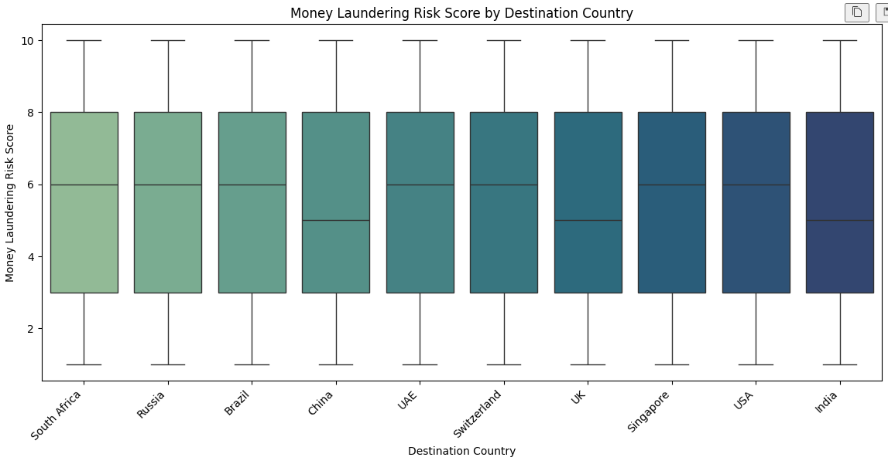
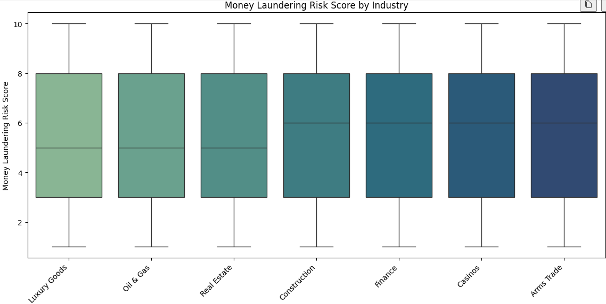
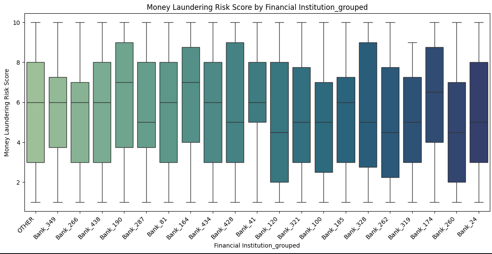
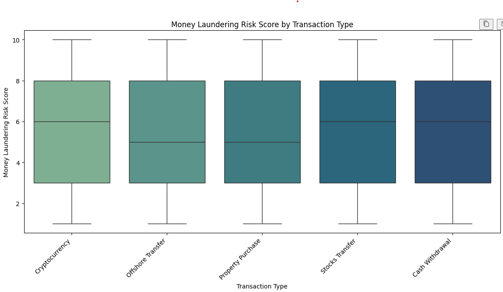

# Отчёт по проекту

**Студент:** Коновченко Петр Михайлович  
**Группа:** БИВ236

---

## 1. Введение и постановка задачи

**Цель проекта** — построить модель, которая по характеристикам финансовой транзакции предсказывает значение `Money Laundering Risk Score`: уровень риска того, что операция связана с отмыванием денежных средств. Практическая ценность — автоматизация первичной оценки, снижение нагрузки на специалистов.

**Формулировка задачи.** Целевая переменная принимает дискретные значения от 1 до 10, поэтому задача — **многоклассовая классификация** (10 классов).

**Обоснование метрики качества.** В качестве основной метрики выбран **weighted F1-score**. `Accuracy` будем использовать для наглядности. `Weighted F1-score` усредняет precision и recall по всем классам с учётом их частоты, поэтому лучше отражает качество классификатора в многоклассовой задаче.

---

## 2. Поиск и описание данных

**Источник.** Использовался датасет **Global Black Money Transactions Dataset** с платформы Kaggle. Выбор обусловлен соответствием требованиям + датасет описывает финансовые транзакции - это интересно.

**Объём и состав.** Датасет содержит **10 000 строк** и **14 столбцов**, из которых один — целевая переменная.

| Признак | Тип | Описание |
|---------|-----|----------|
| `Transaction ID` | категориальный | Уникальный идентификатор транзакции |
| `Country` | категориальный | Страна отправителя |
| `Amount (USD)` | числовой | Сумма операции в долларах США |
| `Transaction Type` | категориальный | Тип транзакции (Cash, Crypto, Transfer и др.) |
| `Date of Transaction` | дата | Дата и время совершения операции |
| `Person Involved` | категориальный | Имя участника транзакции |
| `Industry` | категориальный | Отрасль деятельности участника |
| `Destination Country` | категориальный | Страна получателя |
| `Reported by Authority` | булев | Признак сообщения о транзакции в органы |
| `Source of Money` | категориальный | Источник денежных средств (Legal / Illegal) |
| `Shell Companies Involved` | числовой | Число вовлечённых подставных компаний |
| `Financial Institution` | категориальный | Финансовое учреждение (499 уникальных значений) |
| `Tax Haven Country` | категориальный | Страна налоговой гавани |
| `Money Laundering Risk Score` | числовой (целевая) | Уровень риска отмывания денег, 1–10 |

---

## 3. Обработка и подготовка данных

### Очистка данных

Датасет является синтетическим, поэтому пропущенных значений и полных дубликатов строк выявлено не было. Единственный непрерывный признак — сумма транзакции — проверен на выбросы: аномальных значений не обнаружено. Числовые признаки приведены к числовому типу, категориальные — к типу `category`.

### Feature Engineering

Итоговое число признаков в модели: **17** (после удаления нескольких колонок и добавления новых).

| Новый признак | Из чего | Смысл |
|--------------|---------|-------|
| `transaction_year`, `transaction_month`, `transaction_dayofweek`, `transaction_hour` | `Date of Transaction` | Временные паттерны (сезонность, час суток) |
| `is_illegal` | `Source of Money` | Бинарный флаг: 1 = незаконный источник |
| `is_reported` | `Reported by Authority` | Бинарный флаг: 1 = сообщено в органы |
| `has_tax_haven` | `Tax Haven Country` | Бинарный флаг: 1 = есть офшорная юрисдикция |
| `log_amount` | `Amount (USD)` | для сглаживания распределения и уменьшения модуля значений|
| `Financial Institution_grouped` | `Financial Institution` | Топ-20 банков по частоте; остальные → `OTHER` |

Удалены: `Transaction ID`, `Person Involved` (идентификаторы без предсказательной ценности), `Date of Transaction` (заменена временными признаками), `Source of Money` и `Reported by Authority` (заменены бинарными флагами).

### Анализ целевой переменной

Распределение классов риска практически равномерное — каждый из 10 уровней встречается приблизительно с одинаковой частотой (~1 000 объектов), что исключает проблему дисбаланса классов.

Корреляция числовых признаков с таргетом крайне мала: максимальное значение |r| не превышает **0.02**. Это ключевой вывод: числовые признаки не несут линейной информации о классе риска.

Ящичные диаграммы по категориальным признакам также не выявляют значимой дифференциации уровней риска.

### Сплит данных

Разбивка выполнена стратифицированным образом по таргету в соотношении **70 / 15 / 15**:

| Выборка | Объектов |
|---------|----------|
| train   | 7 000    |
| val     | 1 500    |
| test    | 1 500    |

Data leakage исключён: все трансформации (LabelEncoder, OHE) обучались только на train и применялись к val/test без переобучения.

---

## 4. Baseline-модель

**Гипотеза.** Простая линейная модель задаёт нижнюю планку качества.

**Модель.** `LogisticRegression` (solver=lbfgs, max_iter=1000) с LabelEncoding категориальных признаков, без OHE.

**Результаты.**

| Выборка | Accuracy | Weighted F1 |
|---------|----------|-------------|
| val     | 0.1027   | 0.0742      |
| test    | 0.1133   | 0.0818      |

**Вывод.** Качество вплотную к случайному угадыванию (1/10 = 0.10). Линейная модель не способна выделить паттерны в данных — ожидаемо, учитывая близкие к нулю корреляции всех признаков с таргетом.

---

## 5. Эксперименты

Все эксперименты проводились на одинаковой OHE-матрице признаков (67 колонок после one-hot encoding категориальных переменных). Выбор лучших гиперпараметров — по weighted F1 на validation. Seed фиксирован: `RANDOM_STATE = 42`.

---

### Эксперимент 1: LogisticRegression + OHE

**Гипотеза.** One-hot encoding категориальных признаков даст линейной модели больше информации и улучшит качество по сравнению с baseline на LabelEncoding.

**Как проверялось.** `LogisticRegression` (lbfgs, max_iter=1000) обучена на OHE-матрице (67 признаков). Результат сравнён с baseline.

**Результат.**

| Выборка | Accuracy | Weighted F1 |
|---------|----------|-------------|
| val     | 0.1073   | 0.0704      |
| test    | 0.1087   | 0.0721      |

**Вывод.** OHE не улучшил качество — weighted F1 даже незначительно снизился по сравнению с baseline. Гипотеза не подтвердилась: разбиение категорий на бинарные колонки не помогает линейной границе разделить 10 классов риска.

---

### Эксперимент 2: KNN + OHE (grid search)

**Гипотеза.** Метод ближайших соседей может уловить локальные структуры в пространстве признаков, которые линейная модель игнорирует. Подбор k, метрики и весовой схемы улучшит качество.

**Как проверялось.** Grid search по k ∈ {1..9}, weights ∈ {uniform, distance}, p ∈ {1, 2} через `Pipeline(StandardScaler → KNeighborsClassifier)`. Лучший набор выбран по val F1.

**Результат.**

| Выборка | Accuracy | Weighted F1 | Лучшие параметры |
|---------|----------|-------------|-----------------|
| val     | 0.1160   | 0.1157      | k=4, weights=distance, p=2 |
| test    | 0.1060   | 0.1057      | — |

**Вывод.** KNN превзошёл логистическую регрессию, однако расхождение val/test (~0.01 по F1) указывает на лёгкое переобучение к валидационной выборке. Прирост незначительный — модель по-прежнему работает около случайного уровня.

---

### Эксперимент 3: RandomForest + OHE (grid search)

**Гипотеза.** Ансамбль решающих деревьев способен улавливать нелинейные взаимодействия признаков и должен показать лучшее качество, чем KNN и логистическая регрессия.

**Как проверялось.** Grid search по n_estimators ∈ {50, 100, 200}, max_depth ∈ {None, 10, 20}, min_samples_split ∈ {2, 5}, min_samples_leaf ∈ {1, 2}, max_features ∈ {sqrt, log2}. Всего 72 конфигурации.

**Результат.**

| Выборка | Accuracy | Weighted F1 | Лучшие параметры |
|---------|----------|-------------|-----------------|
| val     | 0.1220   | 0.1217      | n=200, depth=None, mss=2, msl=1, mf=sqrt |
| test    | 0.1067   | 0.1063      | — |

**Вывод.** RandomForest показал наилучший val F1 среди всех моделей. Тем не менее расхождение val/test (~0.015) сохраняется, что говорит о переобучении к validation. Абсолютные значения по-прежнему близки к случайному уровню.

---

### Эксперимент 4: GradientBoosting + OHE (grid search)

**Гипотеза.** Градиентный бустинг с настроенными learning_rate и глубиной деревьев должен превзойти RandomForest за счёт последовательной коррекции ошибок.

**Как проверялось.** Grid search по n_estimators ∈ {50, 100, 200}, learning_rate ∈ {0.01, 0.05, 0.1, 0.2}, max_depth ∈ {2, 3, 5}. Всего 36 конфигураций.

**Результат.**

| Выборка | Accuracy | Weighted F1 | Лучшие параметры |
|---------|----------|-------------|-----------------|
| val     | 0.1107   | 0.1083      | n=50, lr=0.10, depth=5 |
| test    | 0.1093   | 0.1072      | — |

**Вывод.** GradientBoosting не превзошёл RandomForest на validation, хотя test-качество у него стабильнее (меньше расхождение val/test). Гипотеза не подтвердилась.

---

### Сводная таблица экспериментов

| Модель | Val Acc | Val F1 | Test Acc | Test F1 |
|--------|---------|--------|----------|---------|
| Baseline (LogReg, LabelEnc) | 0.1027 | 0.0742 | 0.1133 | 0.0818 |
| LogisticRegression + OHE | 0.1073 | 0.0704 | 0.1087 | 0.0721 |
| KNN + OHE (best grid) | 0.1160 | 0.1157 | 0.1060 | 0.1057 |
| GradientBoosting + OHE (best grid) | 0.1107 | 0.1083 | 0.1093 | 0.1072 |
| **RandomForest + OHE (best grid)** | **0.1220** | **0.1217** | 0.1067 | 0.1063 |

**Общий вывод.** Все четыре модели работают вблизи случайного угадывания. Это закономерное следствие результата EDA: ни числовые признаки (|r| < 0.02), ни категориальные не коррелируют с таргетом в синтетическом датасете, где `Money Laundering Risk Score`, по всей видимости, был сгенерирован независимо от остальных признаков.

---

## 6. Финальная модель и интерпретируемость

**Выбор финальной модели.** Выбран `RandomForestClassifier` — единственная модель, достигшая val F1 = 0.1217, наилучшего среди всех экспериментов. Финальная версия переобучена на объединённой выборке train+val (8 500 объектов) и оценена только на test.

**Гиперпараметры:**
- `n_estimators = 200`
- `max_depth = None`
- `min_samples_split = 2`
- `min_samples_leaf = 1`
- `max_features = "sqrt"`
- `random_state = 42`

**Финальные метрики на test:**

| Accuracy | Weighted F1 |
|----------|-------------|
| 0.1007   | 0.0994      |

**Интерпретируемость.** При F1 ≈ 0.10 feature importance случайного леса не несёт практического смысла: модель распределяет важность почти равномерно среди всех признаков, что характерно для случая, когда ни один из них не является информативным. Ключевой вывод подтверждён на всех уровнях исследования:

- числовые корреляции с таргетом близки к нулю (max |r| = 0.019);
- box-plot по всем категориальным признакам не показывает дифференциации уровней риска;
- ни одна из четырёх моделей не смогла существенно превзойти случайное угадывание.

Это указывает на то, что `Money Laundering Risk Score` в данном синтетическом датасете был сгенерирован независимо от остальных признаков — связи между фичами и таргетом фактически нет.

---

## 7. Заключение и выводы

**Итоги.** В ходе проекта была поставлена задача многоклассовой классификации транзакций по уровню риска отмывания денег (10 классов). Проведён полный цикл ML-исследования: анализ данных, feature engineering, обучение baseline и четырёх экспериментальных моделей с перебором гиперпараметров. Лучший результат — weighted F1 = 0.0994 на тесте (RandomForest, обученный на train+val) — не превышает уровень случайного угадывания (0.10).

**Почему модели не работают.** EDA однозначно показал отсутствие статистической зависимости между признаками и таргетом в данном датасете: корреляции числовых признаков с `Money Laundering Risk Score` не превышают |r| = 0.02, а распределения риска по всем категориальным переменным практически идентичны. Это характерно для синтетических датасетов, где целевая переменная генерируется независимо. Проблема не в моделях — они технически реализованы корректно, — а в фундаментальном отсутствии сигнала в данных.

**Ограничения.**
- Датасет синтетический: статистическая независимость таргета от признаков делает задачу неразрешимой на данных такого рода.

**Возможные улучшения.**
- Заменить датасет на реальные транзакционные данные с подтверждёнными метками.
- Добавить агрегатные признаки по участнику / учреждению / стране (частота транзакций, средний объём, доля подозрительных операций).